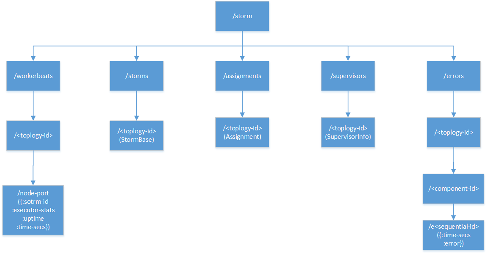
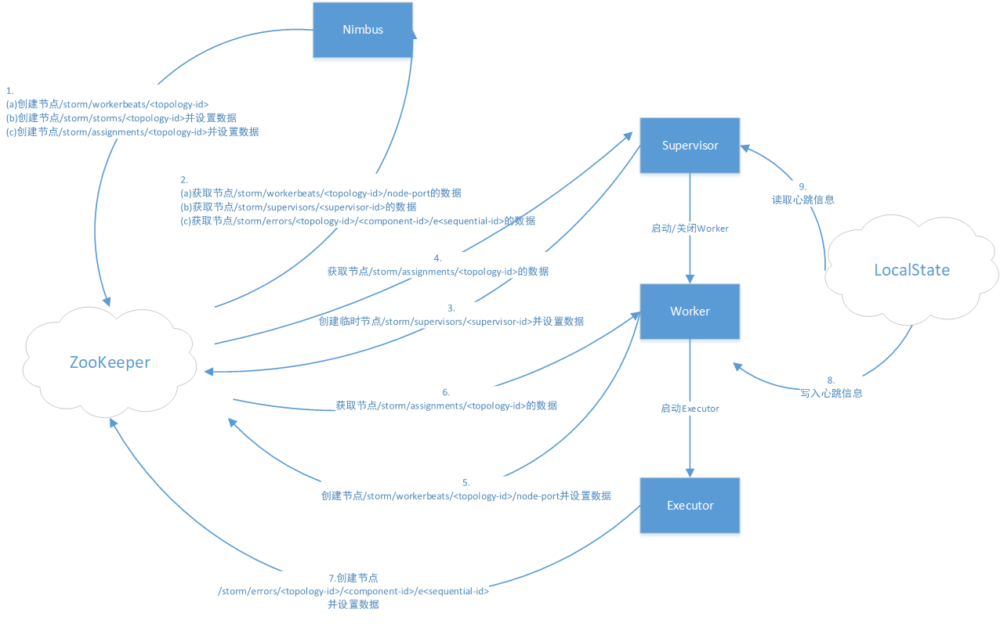

# 
 :avocado: Storm的元数据

> Storm使用ZooKeeper来存储Nimbus、Supervisor、Worker以及Executor之间共享的元数据，这些模块在重启之后，可以通过对于的元数据进行恢复。因此Storm的模块是无状态的，这是保证其可靠性及可扩展性的基础。

## Storm在ZooKeeper中的存储结构

  
 

- /storm/workerbeats/`<topology-id>`/node-port：存储由node和port指定的Worker的运行状态和统计信息，主要包括storm-id(即topology-id)、当前Worker上所有Executor的统计信息（如发送的消息数据、接收的消息数目等）、当前Worker的启动时间以及最后一次更新这些信息的时间。在一个topology-id下面，可能有多个node-port节点。他的内容在运行过程中会被更新

- /storm/storms/`<topology-id>`：存储Topology本身的信息，包括名字、启动时间、运行状态、要使用的Worker数目以及每个组件的并行度设置。它的内容在运行过程中是不变的

- /storm/assignments/`<topology-id>`：存储了Nimbus为每个Topology分配的任务信息，包括该Topology在Nimbus机器本地存储目录、被分配到的Supervisor机器到主机名的映射关系、每个Executor运行在哪个Worker上以及每个Executor的启动时间。该节点数据在运行过程中会被更新

- /storm/supervisors/`<supervisor-id>`：存储Supervisor机器本省的运行统计信息，包括最近一次更新时间、主机名、supervisor-id、已经使用的端口列表、所有的端口列表以及运行时间。该节点数据在运行过程中会被更新

- /storm/errors/`<topology-id>`/`<component-id>`/e`<sequential-id>`：存储运行过程中每个组件上发生的错误信息。`<sequential-id>`是一个递增的序列号，每个组件最多只会保留最近10条错误信息。该节点内容在运行过程中不变（但是有可能被删除）

## Storm与ZooKeeper的交互过程

  
 

- Nimbus
> Nimbus既需要在ZooKeeper中创建元数据，也需要从ZK中获取元数据

    - 箭头1表示有Nimbus创建的路径包括：
        - a./storm/workerbeats/`<topology-id>`
        - b./storm/storms/`<topology-id>`
        - c./storm/assignments/`<topology-id>` 
其中对于路径a，Nimbus只会创建路径，并不会设置数据（数据由Worker设置）。对于路径b和c，Nimbus在创建它们的时候就会设置数据。a和b只有在提交新Topology的时候才会创建，且b中的数据设置好之后就不会变化，c则在第一次为该Topology进行任务分配的时候创建，若任务计划有变，Nimbus就会更新它的内容。

    - 箭头2表示Nimbus需要获取数据的路径，包括:
        - a./storm/workerbeats/`<topology-id>`/node-port
        - b./storm/supervisors/`<supervisor-id>`
        - c./storm/errors/`<topology-id>`/`<component-id>`/e`<sequential-id>` 
Nimbus需要从路径a读取当前已被分配的Worker的运行状态。根据该信息，Nimbus可以得知哪些Worker状态正常

- Supervisor
> 与Nimbus类似，通过ZooKeeper来创建和获取元数据，除此之外，Supervisor太通过监控指定的本地文件来检测有它启动的所有Worker的运行状态。

- Worker
> Worker利用ZooKeeper来创建和获取元数据，同时利用本地文件来记录自己的心跳信息

- Executor
> Executor只会利用ZooKeeper来记录自己的运行错误信息

    - 箭头7表示Executor在ZooKeeper中创建的路径/storm/errors/`<topology-id>`/`<component-id>`/e`<sequential-id>`