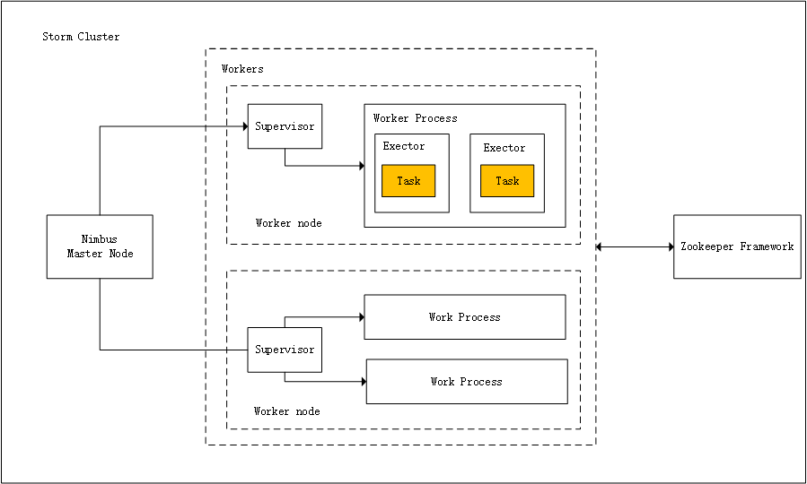
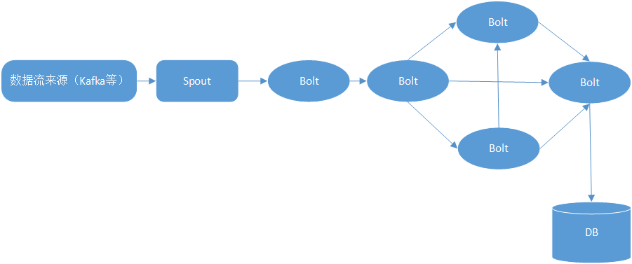

# <center> :tokyo_tower: 基本概念</center>

> Storm是一个分布式的，可靠的，容错的数据流处理系统。它会把工作任务委托给不同类型的组件，每个组件负责处理一项简单特定的任务。Storm 集群的输入流由一个被称作 spout 的组件管理，spout 把数据传递给 bolt， bolt 要么把数据保存到某种存储器，要么把数据传递给其它的 bolt。你可以想象一下，一个 Storm 集群就是在一连串的 bolt 之间转换 spout 传过来的数据。

<!-- MarkdownTOC -->

- [:hammer_and_wrench:安装及配置](#hammer_and_wrench%E5%AE%89%E8%A3%85%E5%8F%8A%E9%85%8D%E7%BD%AE)
- [Storm的集群架构](#storm%E7%9A%84%E9%9B%86%E7%BE%A4%E6%9E%B6%E6%9E%84)
- [Storm核心概念](#storm%E6%A0%B8%E5%BF%83%E6%A6%82%E5%BF%B5)

<!-- /MarkdownTOC -->

## :hammer_and_wrench:安装及配置
- storm的安装参考官网
- 解压后对storm进行配置`conf/sotm.yaml`,基础配置信息如下其余的默认即可。详细的配置信息可以参考官方github中的[`defaults.yaml`](https://github.com/apache/storm/blob/master/conf/defaults.yaml)
```vim
$ vi conf/storm.yaml
storm.zookeeper.servers:
 - "localhost"
storm.local.dir: “/path/to/storm/data(any path)”
nimbus.host: "localhost"
supervisor.slots.ports:
 - 6700
 - 6701
 - 6702
 - 6703
```

## Storm的集群架构
Apache Storm的主要亮点是，它是一个容错，快速，没有“单点故障”（SPOF）分布式应用程序。我们可以根据需要在多个系统中安装Apache Storm，以增加应用程序的容量
<div align="center">  </div><br>
Apache Storm有两种类型的节点，`Nimbus`（主节点）和`Supervisor`（工作节点）.

- `Nimbus`是Storm的核心组件。Nimbus的主要工作是运行Storm拓扑。Nimbus分析拓扑并收集要执行的任务。然后，它将任务分配给可用的supervisor。

- `Supervisor`将有一个或多个工作进程。Supervisor将任务委派给工作进程。工作进程将根据需要产生尽可能多的执行器并运行任务。Apache Storm使用内部分布式消息传递系统来进行Nimbus和管理程序之间的通信。

| 组件                                 | 说明                                                                                                                                                                                                                                    |
| : :                                  | :     :                                                                                                                                                                                                                                 |
| Nimbus（主节点）                     | Nimbus是Storm集群的主节点。集群中的所有其他节点称为工作节点。主节点负责在所有工作节点之间分发数据，向工作节点分配任务和监视故障。                                                                                                       |
| Supervisor（工作节点）               | 遵循指令的节点被称为Supervisors。Supervisor有多个工作进程，它管理工作进程以完成由nimbus分配的任务。                                                                                                                                     |
| Worker process（工作进程）           | 工作进程将执行与特定拓扑相关的任务。工作进程不会自己运行任务，而是创建执行器并要求他们执行特定的任务。工作进程将有多个执行器。                                                                                                          |
| Executor（执行者）                   | 执行器只是工作进程产生的单个线程。执行器运行一个或多个任务，但仅用于特定的spout或bolt。                                                                                                                                                 |
| Task（任务）                         | 任务执行实际的数据处理。所以，它是一个spout或bolt。                                                                                                                                                                                     |
| ZooKeeper framework（ZooKeeper框架） | Nimbus是无状态的，所以它依赖于ZooKeeper来监视工作节点的状态。ZooKeeper帮助supervisor与nimbus交互。它负责维持nimbus，supervisor的状态。 |

## Storm核心概念
> Apache Storm从一端读取​​实时数据的原始流，并将其传递通过一系列小处理单元，并在另一端输出处理/有用的信息。下图描述了Apache Storm的核心概念。

<div align="center">  </div><br>

| 组件    | 描述                                                                                                                                                                                                                                                                                  |
| : :     | : :                                                                                                                                                                                                                                                                                   |
| Toplogy | 整个Storm数据流处理的宏观概念.Spouts和Bolts连接在一起，形成拓扑结构。实时应用程序逻辑在Storm拓扑中指定。简单地说，拓扑是有向图，其中顶点是计算，边缘是数据流。Spouts将数据发射到一个或多个Bolts。Bolt表示拓扑中具有最小处理逻辑的节点，并且Bolts的输出可以发射到另一个Bolts作为输入。 |
| Spout   | 数据源头。Storm从原始数据源（如Twitter Streaming API，Apache Kafka队列，Kestrel队列等）接受输入数据。当然也可以编写spouts从数据源读取数据。“ISpout”是实现spouts的核心接口，一些特定的接口是IRichSpout，BaseRichSpout，KafkaSpout等。                                                  |
| Bolt    | Bolts是逻辑处理单元。Spouts将数据传递到Bolts，并产生新的输出流。Bolts可以执行过滤，聚合，加入，与数据源和数据库交互的操作。Bolts接收数据并发射到一个或多个Bolts。 “IBolt”是实现Bolts的核心接口。一些常见的接口是IRichBolt，IBasicBolt等。                                             |
| Tuple   | Tuple是Storm中的主要数据结构。它是有序元素的列表。默认情况下，Tuple支持所有数据类型。通常，它被建模为一组逗号分隔的值，并传递到Storm集群                                                                                                                                              |
| Stream  | 流是元组的无序序列。                                                                                                                                                                                                                                                                  |
| Trident | Trident是Storm的延伸。用法也更高级。有空再整理                                                                                                                                                                                                                                        |